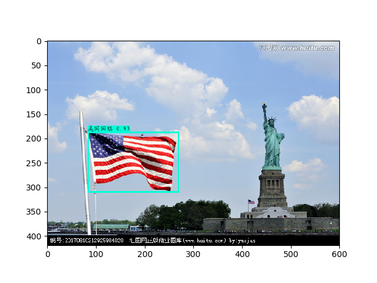
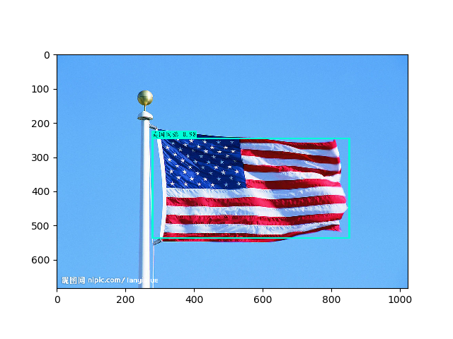

### 部分实验效果(图片来着百度图片爬取)




##### 本项目里有40类旗帜

## 快速开始
#### 1. 下载本项目预训练 权重
- 权重1
```
https://pan.baidu.com/s/1X08Mj2owTcOJQfsBEpf0YA
```
- 权重2
```
https://pan.baidu.com/s/1MIBU41gW1x7aqgQhwglAcw
```
#### 2. 修改yolo.py中第24行权重路径
#### 3. 将需要检测旗帜图片放入sample文件夹中
#### 4. 运行检测
```
python yolo_images.py
```
## 训练
#### 训练自己的数据 无需使用 预训练的权重 （此方法适用于各类数据）
#### step 1
- 使用labelImg对数据进行标记
- 得到xml文件，放置于./model_data/label_train/将图片数据放在于./model_data/train/
(建议图片宽高大于416，不然影响训练)
- 将数据类别写入my_classes.txt中(本项目中name_classes.txt为自定义文件，因为数据标记时，标记的为类别id，为了方便检测时直接输出类别,自己数据预测时将yolo.py中的classes_path修改为自己的)
#### step 2
- 执行xml_to_data.py 生成 kitti_simple_label.txt
```
python xml_to_data.py # 如果自己数据集 请根据自己数据进行更改代码
# 生成的kitti_simple_label.txt 格式为 图片path box,类别id,box,类别id...
```
#### step 3
-  k-means 聚类算法生成对应自己样本的 anchor box 尺寸 生成 my_anchors.txt
```
python kmeans.py
```
#### step 4
- 开始训练(建议epochs大于500，如果内存溢出可减小batch_size。其他参数，按照自己数据，自行修改。)
```
python train.py
```

## 数据集提供
- 旗帜（包含40个种类旗帜），数据来着于网络，数据标注是个苦力活，本数据包含1600多张图片，花费接近一个星期标注完成，且用且珍惜!!!
```
链接:https://pan.baidu.com/s/1sgDehVpMUrXb3AHceTimfA  密码:pgmn
```
- 直接将两个文件夹放置于model_data下
## 项目环境依赖
```
tensorflow                         1.13.1    
Keras                              2.2.4  
h5py                               2.8.0 
opencv-python                      4.0.0.21  
numpy                              1.16.2  
Anaconda3
```
